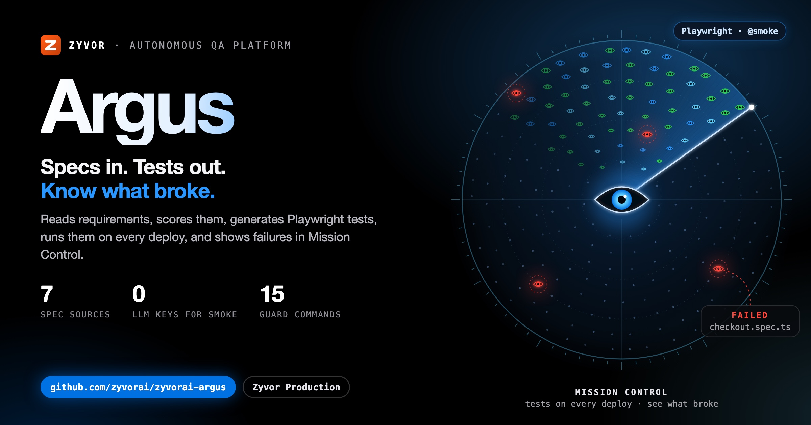
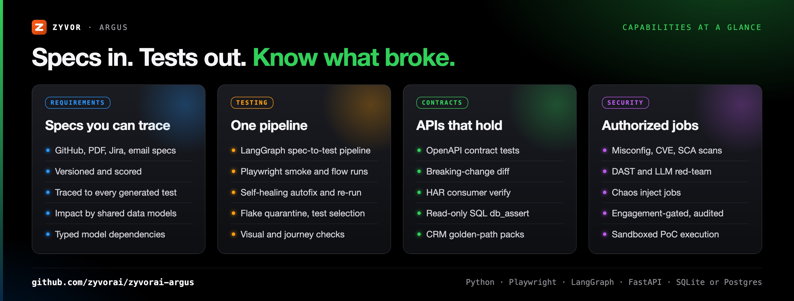
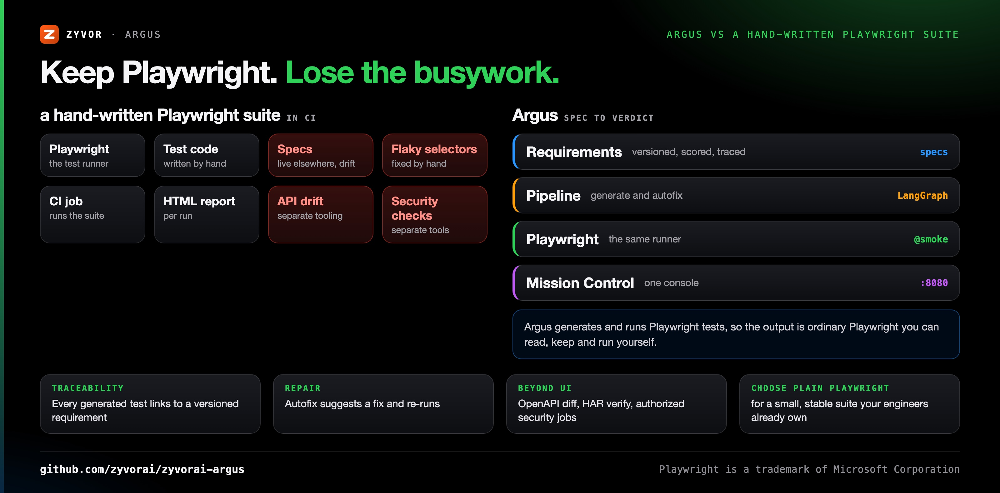
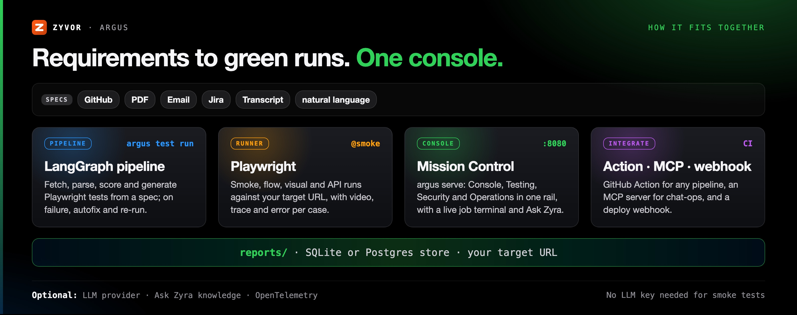
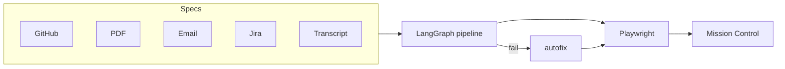

<!-- Copyright (c) 2026 ZyvorAI Labs Private Limited. -->
<!-- SPDX-License-Identifier: LicenseRef-Zyvor-Production-1.0 -->
<div align="center">

# Argus

[](https://github.com/zyvorai/zyvorai-argus/releases/latest)
[](https://github.com/zyvorai/zyvorai-argus/actions/workflows/ci.yml)
[](https://github.com/zyvorai/zyvorai-argus/actions/workflows/security.yml)
[](LICENSE)
[](pyproject.toml)
[](package.json)
[](playwright/)

[](https://zyvor.dev/schedule?utm_source=github&utm_medium=argus&utm_campaign=readme_hero)
[](https://zyvor.dev/poc?utm_source=github&utm_medium=argus&utm_campaign=readme_hero)
[](#quickstart)



### Specs in. Tests out. Know what broke.

**Autonomous QA for the real world.** Argus reads your requirements, scores them, generates Playwright tests, runs them on every deploy, and shows what broke — in Mission Control, a live ops console.

**Requirements traced to tests** · **Playwright under the hood** · **Self-healing autofix** · **No LLM key for smoke** · **CLI · dashboard · GitHub Action · MCP**

</div>

No LLM key required for smoke tests, rule-based parsing, and most dashboard actions. Add a provider when you want richer generation and analysis.

---

## What's new

| | |
|---|---|
| **Test intelligence** | Flake taxonomy with file-backed quarantine (TTL + owner), change-based test selection from `git diff` and requirement links, and a failure studio per case; `argus intel` CLI |
| **Typed model dependencies + impact canvas** | Explicit edges such as Order → Payment, rendered as a typed-dependency list and SVG canvas in Mission Control |
| **Requirements connectors** | Jira OAuth, Gmail/IMAP fallback for email, and a `diarize` source for speaker-tagged transcripts |
| **CRM golden-path packs** | HubSpot, Pipedrive, Zoho and Salesforce, with Zoho and Salesforce UI-first ([guide](docs/crm/README.md)) |
| **Ask Zyra local FastEmbed** | On-box embeddings when no OpenAI-compatible embeddings endpoint is available |
| **Desktop remote Mission Control** | The Tauri shell opens a lab or team `argus serve` by URL |

Full history: [CHANGELOG.md](CHANGELOG.md).

---

## Why Argus

| When this happens… | Argus gives you… |
|---|---|
| Specs and tests drift apart | Requirements that are versioned, scored, and traced to every generated test |
| Smoke runs are a tribal ritual | One command, or one dashboard click, on every deploy |
| Flaky selectors waste the afternoon | Autofix suggests a repair and re-runs |
| API drift is tribal knowledge | OpenAPI contract test, breaking-change diff, and HAR consumer verify |
| Security checks live in spreadsheets | Authorized misconfig, CVE, SCA, DAST, LLM red-team and chaos jobs with an audit trail |
| QA tooling is five products | One Mission Control: Console, Testing, Security and Operations |



### Capabilities

- **Requirements** — versioned, scored, and traced to every generated test, plus impact by shared data models and flows
- **One pipeline** — the same LangGraph path from the CLI or one dashboard click
- **Self-healing autofix** — suggests and applies repairs, then re-runs
- **Contracts** — OpenAPI contract test, breaking-change diff, and HAR consumer verify
- **Authorized security** — misconfig, CVE, SCA, DAST, LLM red-team, and chaos jobs with an audit trail and sandboxed PoC
- **Mission Control** — Console, Testing, Security, and Operations in one rail

Ask Zyra (optional knowledge extra): [docs/tutorials/14-ask-zyra-knowledge.md](docs/tutorials/14-ask-zyra-knowledge.md). What DAST covers, and what it deliberately defers: [docs/security-network-attack-gaps.md](docs/security-network-attack-gaps.md).

---

## Argus vs a hand-written Playwright suite



| | **Argus** | **Hand-written Playwright suite in CI** |
|---|---|---|
| Test runner | Playwright | Playwright |
| Where tests come from | Generated as `.spec.ts` files from versioned, scored requirements | Written and maintained by hand |
| Spec traceability | Every generated test linked to a requirement version | Kept by convention, if at all |
| Broken selectors | Autofix suggests and applies a repair, then re-runs | Fixed by hand |
| Flaky tests | Flake taxonomy, quarantine with TTL and owner, change-based selection | Retries and manual triage |
| API contracts | OpenAPI contract test, breaking-change diff, HAR consumer verify | Separate tooling |
| Security checks | Authorized, engagement-gated jobs with an audit trail | Separate tooling |
| Results | Mission Control console with live job terminal | HTML report per run |
| **Choose plain Playwright when** | | You have a small, stable suite your engineers already own and no need for requirement tracing |

---

## See it live


*Mission Control: grouped side rail · dark theme · Ask Zyra · macOS Terminal live job · Search / ⌘K · 25+ actions*

---

## How it fits together





```bash
argus test run --source github --spec docs/specs/feature.md
argus test run --source document --spec requirements/checkout.pdf
argus flow run https://zyvor.dev --steps docs/assets/zyvor-dev-demo.steps --video
```

Command reference: [docs/test-authoring.md](docs/test-authoring.md).

---

## Quickstart

Requires Python 3.10+, Node 20+, and Docker (only for the container path). `make install` handles the rest, including Playwright's Chromium download.

```bash
git clone https://github.com/zyvorai/zyvorai-argus.git && cd argus
cp .env.example .env          # set ZYVOR_BASE_URL
make install                    # Python venv + Playwright Chromium
argus test exec --grep @smoke   # first green run — no API key
argus serve --port 8080         # → http://localhost:8080/dashboard
```

**Remote deploy in one command:**

```bash
./scripts/deploy-remote.sh YOUR_HOST YOUR_USER --service --key
# Mission Control on port 30080 — credentials printed in deploy summary
```

Container:

```bash
docker pull ghcr.io/zyvorai/zyvor-argus:v0.9.2
docker run --rm -p 8080:8080 --env-file .env ghcr.io/zyvorai/zyvor-argus:v0.9.2 serve --port 8080 --host 0.0.0.0
```

| Track | Where |
| --- | --- |
| **Non-production use** (free under the Zyvor Production License) | This repo |
| **Production / commercial license** | [https://zyvor.dev](https://zyvor.dev/?utm_source=github&utm_medium=argus&utm_campaign=readme_edition) |
| **Docs** | [Tutorials](docs/tutorials/README.md) · [zyvor.dev/docs](https://zyvor.dev/docs?utm_source=github&utm_medium=argus&utm_campaign=readme_suite) |

More: [user manual](docs/user/README.md) · [feature guide](docs/zyvor-argus-user-feature-guide.md) · [configuration](docs/configuration.md) · [remote deploy](docs/remote-deploy.md) · [enterprise overlay](docs/enterprise-v2.md).

---

## Mission Control

`argus serve` exposes **Mission Control** at `/dashboard`.

- **Grouped side rail** — Console (Overview, Ask Zyra) · Testing (Pipeline, Visual, Quality, Journeys, API, Probes, Requirements) · Security · Operations (Runs & schedules)
- **Header** — knowledge lamp, dark/light theme, Search (also **⌘K**)
- **Overview** — hero status, pass rate, next smoke, and a live macOS Terminal job panel (Copy / Save / Stop)
- **Hash routes** — `#pipeline`, `#ask`, `#requirements`, `#operations`

Full action list: [dashboard tutorial](docs/tutorials/10-mission-control-dashboard.md).

## Integrations

- **Any CI/CD pipeline** — the [`action.yml`](action.yml) GitHub Action runs `argus` Playwright-based QA checks against any target URL ([external CI/CD tutorial](docs/tutorials/15-external-cicd-integration.md)).
- **Chat-ops** — an [MCP server](docs/mcp-server.md) exposes a subset of Mission Control's `/api/v2` job API to MCP-capable chat agents.
- **Kubernetes** — manifests under [`kubernetes/`](kubernetes) ([CI/CD and Kubernetes tutorial](docs/tutorials/09-cicd-and-kubernetes.md)).

---

## Important boundaries

What's free under the Zyvor Production License vs. what needs a commercial license
([full guide](docs/LICENSING.md)):

| Use case | Allowed without a paid license? |
| --- | --- |
| Development, testing, evaluation, research, education | Yes |
| Non-production laboratory and proof-of-concept use | Yes |
| Production environments and customer workloads | No — needs a commercial license |
| SaaS, managed services, OEM, appliances | No — needs a commercial license |
| Redistribution or resale | No — needs written permission and a commercial license |

## Star History

[](https://star-history.com/#zyvorai/argus&Date)

---

## Maturity

Current release: **v0.9.2** ([releases](https://github.com/zyvorai/zyvorai-argus/releases/latest)). What is shipped and what is deliberately deferred is tracked in [ROADMAP.md](ROADMAP.md) and the [CHANGELOG](CHANGELOG.md).

---

## Part of the Zyvor stack

| Product | Role next to Argus |
|---|---|
| **Argus** | Autonomous QA: requirements to Playwright tests, autofix, contracts, authorized security jobs |
| **[Chimera](https://github.com/zyvorai/chimera)** | Infrastructure protocol simulator; pairs with Argus when the thing under test talks to vSphere, Nutanix, Hyper-V, AWS or Azure |
| **[Aurora](https://github.com/zyvorai/aurora)** | AI go-to-market platform; sits next to Argus in the Zyvor AI products |
| **[Aether](https://github.com/zyvorai/Aether)** | Runtime portability plane for the apps Argus tests |

→ [zyvor.dev](https://zyvor.dev)

---

## License

Argus is source-available under the **[Zyvor Production License v1.0](LICENSE)** (SPDX `LicenseRef-Zyvor-Production-1.0`).

- **Free** for development, testing, evaluation, research, education, and non-production labs.
- **Production use** (production, customer workloads, SaaS, managed services, OEM, redistribution, and other revenue-generating use) requires an annual enterprise subscription. Plans, support levels and terms: [docs/SUBSCRIPTION-MODEL.md](docs/SUBSCRIPTION-MODEL.md) · [licensing guide](docs/LICENSING.md) · [Pricing](https://zyvor.dev/pricing?utm_source=github&utm_medium=argus&utm_campaign=readme_license) · [sales@zyvor.dev](mailto:sales@zyvor.dev).

Commercial terms are issued separately: [https://zyvor.dev](https://zyvor.dev/?utm_source=github&utm_medium=argus&utm_campaign=readme_footer).

Contributions: [CLA.md](CLA.md) + [DCO.md](DCO.md) (`git commit -s`), governed by our [Code of Conduct](CODE_OF_CONDUCT.md); see [CONTRIBUTING.md](CONTRIBUTING.md). Report vulnerabilities privately per [SECURITY.md](SECURITY.md).

---

<div align="center">

### Know what broke before your customers do

[](https://zyvor.dev/schedule?utm_source=github&utm_medium=argus&utm_campaign=readme_footer)
[](https://zyvor.dev/poc?utm_source=github&utm_medium=argus&utm_campaign=readme_footer)
[](https://zyvor.dev/pricing?utm_source=github&utm_medium=argus&utm_campaign=readme_footer)
[](mailto:sales@zyvor.dev?subject=Argus)
[](https://github.com/zyvorai/zyvorai-argus)

</div>
